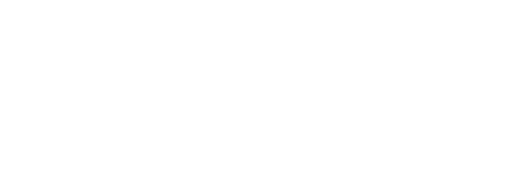

    

A flexible and reusable WordPress theme powered by [ACF Pro][acf] and [WooCommerce][woocommerce], designed for consistent, lightweight, and customizable websites.

---

> Please note that **QubedWP** is an internal project of Qubed Group

## Installation

Clone this repository into your WordPress setup and activate the **QubedWP** theme.  
For site-specific customizations, use the included `qubedwp-child` theme to extend safely.

---

## License

QubedWP is licensed under the _Functional Source License, Version 1.1_. It's free to use for
internal and non-commercial purposes, but it's not allowed to use a release for commercial purposes (competing use). See our [full license][license] for more details.

### Contributing

This project is under active development. Contributions are welcome.

---

[acf]: https://www.advancedcustomfields.com/
[woocommerce]: https://woocommerce.com/
[license]: LICENSE.md